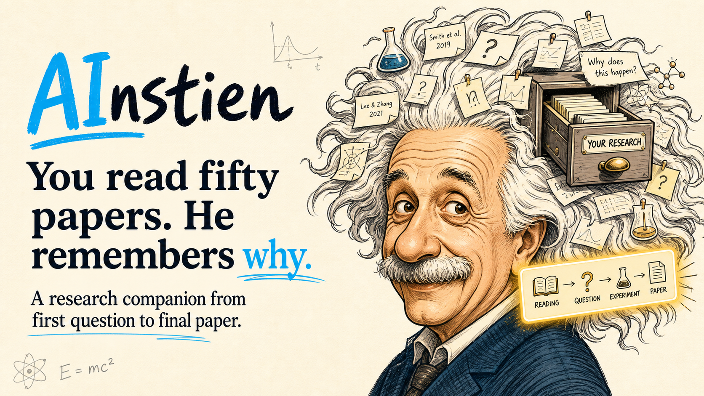

<p align="center">
  
</p>

<h1 align="center">AInstien</h1>

<p align="center">
  <strong>A portable research companion for coding agents.</strong>
</p>

<p align="center">
  Move from messy curiosity to source-backed research output with Codex, Cursor, Claude, Antigravity, Gemini-style agents, or any agent that reads <code>AGENTS.md</code>.
</p>

<p align="center">
  <a href="#install">Install</a> ·
  <a href="#agent-support">Agent Support</a> ·
  <a href="#research-home">Research Home</a> ·
  <a href="#research-flow">Research Flow</a> ·
  <a href="#example-prompts">Examples</a>
</p>

---

## Why AInstien

Most AI research workflows jump too quickly from topic to answer. AInstien keeps the real research process alive: reading deeply, discussing papers, preserving confusions, forming ideas, testing claims, auditing evidence, and writing only when the story is strong.

```text
papers/discussion -> questions/confusions -> idea-bank -> claim-sheet -> experiment-plan -> experiment-log -> evidence-audit -> paper-readiness
```

AInstien is not a one-shot paper generator. It is a stateful research companion that helps a researcher build taste over many sessions.

## Research Flow

```text
CHOOSE -> READ -> THINK -> HYPOTHESIZE -> EXPERIMENT -> VALIDATE -> COMMUNICATE
```

The loop is recursive. A real project may move through reading, discussion, idea incubation, question sharpening, experimentation, and validation many times before writing.

## What It Does

| Research moment | AInstien helps with |
| --- | --- |
| Starting a project | Creates a project-specific research state and next reading direction |
| Reading papers | Extracts objective details and guides reflection without form-filling |
| Discussing papers | Saves questions, clarified concepts, confusions, and ideas sparked |
| Mapping a field | Organizes foundations, methods, evaluations, disagreements, and gaps |
| Finding ideas | Captures hunches in an idea bank before judging them too early |
| Sharpening claims | Tests whether ideas are surprising, fruitful, rigorous, and feasible |
| Experimenting | Plans tests with baselines, controls, falsification criteria, and confounds |
| Interpreting results | Calibrates claim breadth to evidence breadth and catches overclaiming |
| Writing | Checks paper readiness and creates an outline only when the story exists |

## Agent Support

AInstien ships the same core research workflow through multiple agent adapters.

| Agent or host | Entry file |
| --- | --- |
| Codex skill | `skills/ainstien-research/SKILL.md` |
| Codex plugin | `.codex-plugin/plugin.json` |
| Cursor | `.cursor/rules/ainstien-research.mdc` |
| Claude | `CLAUDE.md` and `.claude-plugin/plugin.json` |
| Antigravity / Gemini-style agents | `gemini-extension.json` and `.agents/rules/ainstien-research.md` |
| Generic coding agents | `AGENTS.md` |

The canonical source of behavior is always:

```text
skills/ainstien-research/SKILL.md
```

## Research Home

The cloned AInstien repository is the tool source, not the user's research storage. On first use, AInstien looks for `research-states/research-index.md`. If none exists, it must ask the user to choose a persistent research home and verify write access before creating any state.

Recommended separation:

```text
ainstien/       # public tool checkout
my-research/    # private, long-lived research workspace
  research-states/
```

AInstien never silently initializes in temporary folders, generated date-based Codex workspaces, or its own source checkout. A project keeps the same slug across months or years; dates belong inside logs and metadata.

## Multi-Project State

AInstien keeps each research journey separate. These are possible journey artifacts; AInstien creates them when the workflow calls for them.

```text
research-states/
  research-index.md
  nlp-synthetic-data/
    research-state.md
    reading-log.md
    discussion-notes.md
    literature-map.md
    idea-bank.md
    claim-sheet.md
    experiment-plan.md
    experiment-log.md
    evidence-audit.md
    paper-outline.md
  mech-interp-circuits/
    research-state.md
    reading-log.md
    discussion-notes.md
    literature-map.md
    idea-bank.md
    claim-sheet.md
    experiment-plan.md
    experiment-log.md
    evidence-audit.md
    paper-outline.md
```

If you continue an existing project, AInstien updates that project's folder. If your request is ambiguous, it should ask which journey to use before updating state.

## Install

### Codex Skill

Copy the skill folder into your Codex skills directory:

```powershell
Copy-Item -Recurse .\skills\ainstien-research $env:USERPROFILE\.codex\skills\
```

Then open a separate, long-lived research workspace and invoke AInstien there. On first use it will ask where to initialize the research home if no existing index is found.

Invoke it with:

```text
Use $ainstien-research to start a research journey on mechanistic interpretability.
```

### Cursor

Open this repository in Cursor. Cursor should pick up:

```text
.cursor/rules/ainstien-research.mdc
```

Then ask Cursor to use AInstien for research work in the repo.

### Claude

Open this repository with Claude Code or another Claude-based coding agent. Claude should see:

```text
CLAUDE.md
.claude-plugin/plugin.json
```

Ask Claude to read `skills/ainstien-research/SKILL.md` before research tasks.

### Antigravity / Gemini-Style Agents

Use the extension metadata and generic rule files:

```text
gemini-extension.json
.agents/rules/ainstien-research.md
```

### Generic Agents

For agents that read repository guidance, use:

```text
AGENTS.md
```

## Example Prompts

```text
Use AInstien to start a new journey called nlp-synthetic-data about whether synthetic data improves reasoning robustness in small language models.
```

```text
Use AInstien to start a separate journey called mech-interp-circuits about finding circuits for refusal behavior.
```

```text
Continue nlp-synthetic-data. Here are five papers I read. Update my research state and tell me what pattern is emerging.
```

```text
Continue mech-interp-circuits. This paper made me wonder whether SAE features are stable across tasks. Add it to my idea bank and tell me how to sharpen it.
```

```text
Turn my best idea into an experiment plan with baselines, controls, falsification criteria, and expected confounds.
```

```text
Log these experiment results and audit whether my evidence supports my claim or whether I am overclaiming.
```

```text
Decide whether nlp-synthetic-data is paper-ready.
```

## Design Principles

- The cloned skill repository and the user's private research home are separate.
- Research state must live in a user-confirmed persistent location, never a silent temporary/date-based default.
- Research is not paper production. Paper writing comes after discovery.
- Reading should produce taste, not just summaries.
- Reading-log fields are reflective lenses, not mandatory interrogation prompts.
- Questions asked during paper discussion are part of the research record.
- Early ideas should be preserved before being judged.
- Experiments should test claims, not just produce impressive numbers.
- Claims should be precise enough to be wrong.
- Evidence should scale with ambition.
- Multiple research journeys should never overwrite each other.
- Good research changes the reader's cognitive state.
- The research state is the companion's memory surface.

## Repo Structure

```text
ainstien/
  AGENTS.md
  CLAUDE.md
  README.md
  assets/ainstien.png
  gemini-extension.json
  package.json
  .agents/rules/ainstien-research.md
  .claude-plugin/plugin.json
  .codex-plugin/plugin.json
  .cursor/rules/ainstien-research.mdc
  skills/ainstien-research/
    SKILL.md
    agents/openai.yaml
    assets/ainstien.png
    references/
    assets/templates/
```

## Status

Early public draft. AInstien is designed to grow through real research journeys, examples, community templates, and agent-specific adapters.
